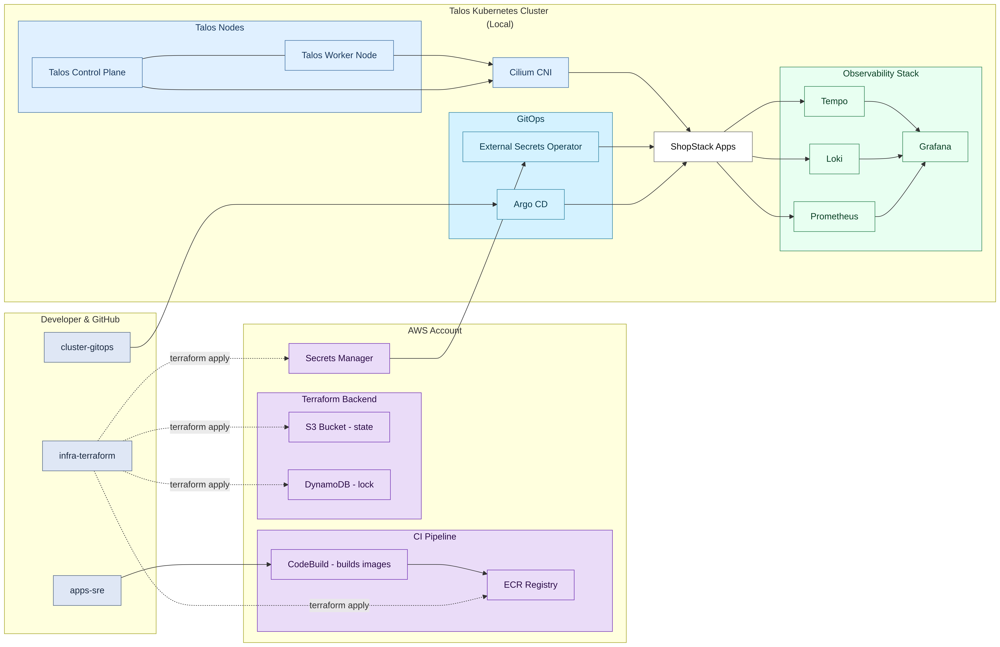

# 🏗️ **ShopStack Architecture Overview**

A complete overview of the **ShopStack** project architecture and repository relationships.

---

## 📦 **Repositories Overview**

| Repository | Purpose | Main Technologies |
|-----------|---------|-------------------|
| **infra-terraform** | Defines and provisions the foundational AWS infrastructure (Terraform remote state backend, IAM/OIDC integration, ECR, Secrets Manager, and build hooks). | Terraform, AWS (S3, DynamoDB, IAM, ECR, Secrets Manager) |
| **cluster-gitops** | Manages cluster provisioning, configuration, and repeatability testing using Kind and GitOps workflows. | Kind, kubectl, Makefile |
| **apps-sre** | Hosts applications and observability stacks that run inside the Kubernetes cluster. | Docker, Helm, Argo CD *(future)* |

---

## ☁️ **AWS Integration Scope (infra v1)**

This section defines the AWS integration scope for **infra v1** of ShopStack.

- **Terraform remote state backend**
  - `core/backend` module creates:
    - An S3 bucket to store Terraform remote state.
    - A DynamoDB table to provide state locking.
  - Used by `envs/dev` to safely manage infrastructure changes.

- **Secrets Manager**
  - AWS Secrets Manager will store runtime secrets for ShopStack (API keys, database credentials, etc.).
  - `core/secrets` module (infra-terraform) manages the secret metadata and naming convention (e.g. `shopstack/dev/app-config`).
  - Secret values can be injected later into workloads (Kubernetes manifests or app configs) in future sprints.

- **ECR (Elastic Container Registry)**
  - `core/ecr` module provisions an ECR repository per environment (e.g. `shopstack-dev`).
  - Used to store container images built for ShopStack applications.
  - Images are pushed from CI (GitHub Actions / CodeBuild) and later pulled by the runtime environment (Kind/Talos/EKS).

- **CodeBuild (build integration)**
  - A CodeBuild project will be used as a managed build step to:
    - Build Docker images from application repositories.
    - Push images to the ECR repository created by `core/ecr`.
  - CodeBuild will be triggered via GitHub Actions or future CI workflows using IAM roles instead of long-lived credentials.

- **GitHub OIDC (federated IAM access)**
  - `core/github-oidc` module defines:
    - An IAM OIDC provider for `token.actions.githubusercontent.com`.
    - An IAM role that can be assumed only by specific GitHub repositories/branches (e.g. `repo:<org>/<repo>:ref:refs/heads/main`).
  - This role will grant least-privilege access to:
    - Read/write the Terraform remote state in S3/DynamoDB.
    - Push images to ECR.
    - Interact with CodeBuild when needed.
  - This removes the need for static AWS keys in GitHub and aligns with AWS recommended security practices.

---

## 🧭 **Architecture Diagram (Text Representation)**

```plaintext
Developer
│
├── infra-terraform
│   ├── S3 bucket (Terraform backend)
│   ├── DynamoDB table (Terraform state lock)
│   ├── AWS Secrets Manager (app secrets skeleton)
│   ├── ECR repository (container images per env)
│   └── IAM + OIDC role (GitHub Actions / CI access)
│
├── cluster-gitops
│   ├── Kind cluster (shopstack)
│   ├── kube-system components (CoreDNS, etc.)
│   └── Repeatability automation via Makefile
│
└── apps-sre
    ├── App deployment (CI/CD)
    └── Future observability stack (Grafana, Prometheus)
```
---

## 🪜 **Bootstrap Sequence Summary**

### 1. Infrastructure Setup
Initialize the Terraform backend in AWS S3 and DynamoDB:

```bash
cd infra-terraform/envs/dev
terraform init
terraform plan
terraform apply
```

### 2. Cluster Creation

Switch to the cluster-gitops repository and create the local Kind cluster:
```bash
cd ../cluster-gitops
kind create cluster --name shopstack --config kind-config.yaml
```
### 3. Validation

Verify cluster readiness:
```bash
kubectl get nodes
kubectl get pods -n kube-system | grep coredns
```
### 4. Repeatability Test

Run automated validation:
```bash
make repeat-test
```
Results are saved to repeat.log.

---

## 🔒 **Security Notes**
    - No public endpoints exposed (local Kind cluster).
	- Kubeconfig protected with:
```plaintext
chmod 600 ~/.kube/config
```
	- Terraform state stored in a private AWS S3 bucket with DynamoDB locking.
	- GitHub CI uses federated IAM access via OIDC instead of static AWS credentials (infra v1 scope).

---

## 🧩 **Future Improvements**

	- Add CI/CD pipeline for infrastructurechanges using GitHub Actions + OIDC.
 	- Integrate EKS managed cluster for cloud testing.
	- Enable additional security scanning tools (Trivy, kube-bench, tfsec/Trivy for Terraform).	
    - Automate bootstrap across all repositories with a unified Makefile and shared scripts.
---

## 🗂️ **Folder Structure**
```bash
infra-terraform/
├── core/
│   ├── backend/          # S3 + DynamoDB for Terraform remote state
│   ├── vpc/              # Experimental VPC module (not used in infra v1)
│   ├── github-oidc/      # IAM OIDC provider + role for GitHub Actions (planned)
│   ├── ecr/              # ECR repository definitions (planned)
│   └── secrets/          # Secrets Manager layout (planned)
├── envs/
│   └── dev/
│       ├── backend.tf    # Backend configuration using S3/DynamoDB
│       ├── main.tf       # Environment stack (modules wiring)
│       ├── outputs.tf
│       └── versions.tf
├── talos/                # Talos cluster configuration files (local cluster)
├── backend/              # Local bootstrap state (not used in normal flows)
├── Makefile
└── docs/
    └── ARCHITECTURE.md
```
# Architecture Overview



---

## 🧭 **Additional Documentation**

This document complements:
```plaintext
    - cluster-gitops/docs/BOOTSTRAP.md → Cluster operations
	- apps-sre/docs/README.md → Application deployments
```
Together, all repositories form a reproducible, modular, and secure DevOps workflow under the ShopStack project umbrella.


